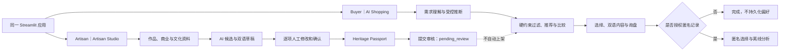

# HAHA

## HAHA Growth Studio

HAHA now gives every cultural heritage artisan an AI-powered digital growth team:

```text
Digitize -> Understand the market -> Build strategy -> Create -> Verify -> Improve
```

The Artisan-side Growth Studio coordinates Market Intelligence, Marketing Strategy,
multi-channel Creative, and a Cultural Guardian. Campaign generation is separate from
catalogue publication: draft or pending products remain ineligible for Buyer search,
unknown facts remain unknown, and automatic revision stops after two cycles. See
[`docs/wave4/GROWTH_STUDIO.md`](docs/wave4/GROWTH_STUDIO.md).

Competition presentation references:

- [`docs/UI_UX_GUIDE.md`](docs/UI_UX_GUIDE.md)
- [`docs/UX_TERMINOLOGY.md`](docs/UX_TERMINOLOGY.md)
- [`docs/COMPETITION_DEMO.md`](docs/COMPETITION_DEMO.md)

## Heritage Artisans, Horizons Ahead

> 连接非遗手艺人、文化礼品与全球买家的 AI 出海智能体

HAHA 是一个面向全球礼赠市场的非遗出海智能体：帮助买家理解、比较文化礼品并形成双语销售询盘，也帮助手艺人把作品故事、文化来源和商业条件整理成可人工审核的资料草稿。

An AI agent connecting heritage artisans, culturally meaningful gifts, and global buyers through grounded recommendations and bilingual sales workflows.

```text
HAHA
└── 飞颐礼遇 AI 礼赠顾问｜HeritageLink AI Gift Advisor
```

| 快速入口 | 当前状态 |
|---|---|
| [Live Demo](https://feiyi-haha-ai.streamlit.app/) | 已公开，2026-08-05 验证可访问 |
| [Demo Video](https://www.bilibili.com/video/BV1rcMm64ELw/) | 2 分 50 秒完整项目演示 |
| [Wave 3 Docs](docs/wave3/README.md) | 评审路径、Demo、证据与合规材料 |
| [Artisan Studio](docs/wave4/ARTISAN_STUDIO.md) | 手艺人资料录入、人工确认与发布边界 |
| [Heritage Passport](docs/wave4/HERITAGE_PASSPORT.md) | 逐字段来源、核验状态与 Buyer 展示规则 |
| [Agent Manifest](docs/wave3/agent_manifest.yaml) | 统一入口、七项 Skills 与回退配置 |
| Validation | 命令见 [Local Setup](#local-setup)；结果只以实际运行记录为准 |

> 非遗不缺少故事，缺少的是从故事到理解、从理解到选择、从选择到合作的连接。

## 为什么需要 HAHA

非遗的文化价值并不需要 AI 来创造。真正的难点，是怎样让不同语言和文化背景的人准确理解这种价值，并把兴趣转化为合适、审慎的礼赠选择。

### 文化理解断层

海外客户可能看到一件产品，却不了解它的工艺背景、图案寓意、适合的赠礼对象，以及如何向收礼人解释这份礼物。单纯展示商品图片和参数，难以完成这一步。

### 需求匹配断层

用户很少用商品字段描述需求。他们更可能说“送海外合作伙伴”“给教授准备礼物”“用于企业周年”，或“希望有中国特色，但不要太传统”。普通目录可以被浏览，却无法把这些自然语言转成可执行的选品条件。

### 销售转化断层

从喜欢一件作品到形成询盘，还需要确认数量、预算、Logo、包装、题字、目的地、交期和其他待定条件。遗漏这些信息，文化兴趣就很难进入下一步商业沟通。

### 数字能力断层

手艺人和小型文化品牌拥有工艺知识与创作判断，但多语言内容、海外客户沟通、推荐系统和数据分析往往需要额外的技术投入。问题不在于非遗缺少价值，而在于这种价值尚未被转换成海外客户容易理解和行动的方式。

HAHA 因此把需求理解、受控推断、确定性推荐、双语文化内容、销售询盘和匿名选择分析组织成一条有边界的 Agent 工作流。它服务海外礼赠市场，但不替手艺人定义文化，也不替商家承诺尚未核实的商业条件。

## 我们的理念

AI 不应该替代手艺人定义文化，而应该帮助文化被更准确地理解。

AI 不应该编造传统故事，而应该基于可追溯资料组织表达。

AI 不应该替商家做出价格、交期和产能承诺，而应该帮助买卖双方识别仍需确认的条件。

> Culture remains human. AI builds the bridge.
>
> 文化属于人，AI 负责搭桥。

HAHA 不是替手艺人讲故事，而是帮助不同语言和文化背景的人更准确地听懂故事。

## HAHA 如何支持非遗传承

### 1. 文化信息结构化

项目把工艺、地域、材料、文化寓意、适用对象、礼赠场景、定制能力和来源状态整理为可搜索、可推荐、可审核的数据。来源与商品、图片和双语内容通过稳定 ID 关联。

这让文化知识不只停留在长篇介绍里，也能进入真实的选品和销售流程。当前数据结构见 [Data Schema](docs/DATA_SCHEMA.md)，目录审计见 [Catalog Expansion Report](docs/CATALOG_EXPANSION_REPORT.md)。

### 2. 跨文化表达

双语内容 Skill 只组织本地已有的 `zh-CN` 与 `en` 内容、来源说明和审核状态。它不会在运行时机器翻译或补写未知事实，也不会把馆藏参考误写成当代商品资质。

项目尝试保留文化含义，并按礼赠语境解释“为什么适合送给谁、用于什么场景”。所有 108 条双语内容目前均为 `draft`，仍需真实商家或文化审核者确认。这个边界降低了海外客户的理解门槛，也避免为了传播而牺牲准确性。

### 3. 商业机会连接

Agent 把自然语言需求转换为结构化条件，在 23 件正式演示商品中执行硬约束过滤和稳定排序，解释推荐理由，并在用户选品后生成包含预算、数量、定制、目的地、交期和待确认事项的 Inquiry JSON。

这条路径帮助文化兴趣进入商业沟通，但仓库没有真实订单、成交、收入增长或合作商家的可验证证据。当前成果是一个销售支持原型，不是已经完成的商业验证。

### 4. 可持续学习闭环

用户明确授权后，系统可以匿名记录推荐结果、最终选择、场景、预算区间、排名位置和定制偏好。离线分析再聚合这些事件，用于观察产品选择、使用场景、排名位置和定制需求。

隐私和分析边界写在代码里：

- 未授权时零写入；
- 默认不保存聊天原文、姓名或联系方式；
- 数据库故障不会阻断推荐和方案生成；
- Skill 7 只做离线按需分析，不自动修改推荐权重；
- 样本不足时隐藏比例并显示警告，不形成强结论；
- 合成数据会明确标注，不代表真实客户偏好。

它为未来依据真实、匿名的选择信号改进产品呈现和市场策略提供了技术路径。目前尚无足够真实授权数据支持稳定的市场结论。

## 从“保护”到“可持续参与”

非遗传承不仅是保存一件作品或记录一段历史，也包括让工艺继续被使用、被理解、被购买，并让创作者拥有持续参与市场的机会。让传统工艺进入当代生活和真实市场，是活态传承的一部分。

商业不是文化传承的唯一答案，但可持续的市场参与能够为手艺人继续创作提供更多可能。手艺人仍是工艺、文化表达和商业承诺的主体，HAHA 提供的是连接需求、资料和沟通的工具。

HAHA 当前是技术原型和销售支持基础设施，不代表已经实现长期收入增长或完成规模化商业验证。现阶段的贡献是建立一条可验证的技术路径：文化事实有来源，产品数据有边界，海外礼赠需求可以被结构化，选择可以形成询盘，授权反馈可以进入匿名分析。

## End-to-End Workflow｜How It Works



Buyer 是默认入口；顶部切换或 `?mode=artisan` 进入 Artisan Studio。两条路径共用页面框架，但数据和授权边界分开：Skills 1 至 6 位于 Buyer 主链，Skill 7 是离线分析支线；Artisan Studio 是独立 application-layer workflow，不是第八项 Skill。手艺人草稿写入独立 Repository，提交后只成为 `pending_review`，不会自动进入 Buyer 目录。

In short: HAHA turns buyer intent into a grounded shortlist and inquiry, while helping artisans prepare source-aware product drafts for human review. Neither path lets AI invent facts or publish a product automatically.

## Seven Skills

七项正式 Skills 的 ID、代码入口和执行顺序以 [Agent Registry](src/heritagelink/agent_registry.py) 与 [Agent Manifest](docs/wave3/agent_manifest.yaml) 为准。

| Skill ID | 中文名称 / English name | 解决的问题 | 对非遗的意义 |
|---|---|---|---|
| `understand_gift_request` | 礼赠需求理解 / Understand Gift Request | 自然语言转为累计结构化需求 | 让文化产品进入真实使用场景 |
| `infer_soft_preferences` | 受控软偏好推断 / Infer Soft Preferences | 只在允许字段内补充风格、寓意等软偏好 | 降低理解和选择门槛，不猜测商业事实 |
| `recommend_heritage_gifts` | 非遗礼品硬过滤与稳定推荐 / Recommend Heritage Gifts | 执行硬过滤、固定权重与稳定排序 | 避免文化产品被随意或错误匹配 |
| `compose_grounded_content` | 有事实边界的双语文化内容组织 / Compose Grounded Content | 从本地双语资料组织有来源边界的内容 | 支持跨文化理解并保留审核状态 |
| `build_final_gift_plan` | 最终礼品方案生成 / Build Final Gift Plan | 将确认需求和选品转为 Inquiry JSON | 连接文化兴趣与后续商业行动 |
| `capture_consented_choice` | 匿名授权选择记录 / Capture Consented Choice | 经授权幂等保存结构化选择 | 建立最小化、可审计的市场反馈 |
| `analyze_gift_choice_signals` | 匿名礼品选择信号分析 / Analyze Gift Choice Signals | 离线输出漏斗、产品、排名和分群指标 | 为未来产品与市场优化提供依据 |

统一 Agent 入口：

```python
heritagelink.agent_orchestrator:run_agent_turn
```

离线分析入口：

```python
heritagelink.skills.choice_analysis_skill:run_choice_signal_analysis
```

## 可信与边界

对于非遗项目而言，避免错误传播与扩大传播同样重要。

- 不虚构非遗资质、传承人身份或政府背书；
- 不虚构价格、库存、产能、交期或国际运输能力；
- 未知商业条件保留为 `null`、待确认项或风险提示；
- 参考产品不进入正式推荐；
- `draft`、`pending_review`、`reference_only` 与 `archived` 的手艺人资料不进入正式推荐；
- 只有显式人工确认才能把候选字段升级为 `artisan_confirmed/confirmed`；
- DeepSeek 仅作可选字段提取，推荐资格与排序由本地确定性代码决定；
- 模型或数据库不可用时使用安全回退，不补造产品或事实；
- execution trace 默认隐藏并集中脱敏，不包含聊天原文、PII、API Key 或数据库地址。

目录中记录的价格、数量、交期、运输和定制字段均为 `demo_assumption`，不构成报价或履约承诺。文化内容虽然有公开来源，当前审核状态仍为草稿。

## Catalog｜当前目录

以下数字由 `data/demo/products.csv` 和 `data/demo/product_texts.csv` 的当前内容计算，不沿用历史文档缓存值。

| 项目 | 当前值 |
|---|---:|
| 产品目录总数 | 54 |
| 正式参与演示推荐 | 23 |
| 文化或馆藏参考 | 30 |
| 其中合作方提供、尚待核验 | 4 |
| 文化内容记录 | 108，中文与英文各 54 条 |
| 类别覆盖 | 11 类 |
| 数据质量 | 54 件均为 C 级演示数据 |
| 已核验真实商家 | 0 |

类别覆盖 `bamboo`、`calligraphy`、`ceramics`、`fan`、`iron_painting`、`jade`、`lacquer`、`seal`、`tea`、`textile` 和 `woodblock`。来源注册表保存来源网址、发布者、访问日期、支持事实和可信等级；覆盖矩阵用于审计类别、地区、价格带与标签分布。

23 件 `recommendation_demo` 记录处于 `active` 状态。30 件 `catalog_reference` 与 1 件 `partner_pending_verification` 记录处于 `inactive` 状态，不具备已核验的价格、产能、定制或交付信息。参考产品用于扩展文化视野和研究，不会在缺少商业可行性信息时被推荐为可购买商品。

54 件中的 50 件，图片和馆藏事实来自大都会艺术博物馆开放馆藏，目录记录为 CC0 1.0 / Public Domain。剩余 4 件为合作方提供的当代芜湖铁画作品，没有对应馆藏记录，图片许可为 `partner_supplied_photo`，`verification_status` 均为 `needs_verification`；其中 3 件的照片经生成式 AI 编辑（透视校正、背景清理、色温与曝光），`image_status` 记为 `generative_edit_from_photograph`。仓库不为这些作品编造藏品号或来源链接。馆藏来源不代表馆方参与本项目，也不证明当代商品与馆藏对象存在商业关联。

## Evidence｜可验证证据

| 证据 | 位置 |
|---|---|
| Agent 统一入口、状态机与门控 | [`agent_orchestrator.py`](src/heritagelink/agent_orchestrator.py) |
| 七项 Skill 注册表 | [`agent_registry.py`](src/heritagelink/agent_registry.py) |
| 机器可读 Agent 清单 | [`agent_manifest.yaml`](docs/wave3/agent_manifest.yaml) |
| 脱敏 execution trace 与评审门控 | [`agent_trace.py`](src/heritagelink/agent_trace.py) |
| 硬过滤、固定权重与稳定排序 | [`recommender.py`](src/heritagelink/recommender.py) |
| 双语内容与来源边界 | [`content.py`](src/heritagelink/content.py) |
| Artisan 草稿、冲突保护与人工确认 | [`artisan_studio.py`](src/heritagelink/artisan_studio.py) |
| Heritage Passport、来源与发布状态 | [`heritage_passport_models.py`](src/heritagelink/heritage_passport_models.py) |
| canonical 产品到文化护照的保守适配 | [`heritage_passport.py`](src/heritagelink/heritage_passport.py) |
| 正式推荐资格门控 | [`catalog_eligibility.py`](src/heritagelink/catalog_eligibility.py) |
| Artisan 内存与 SQLite 草稿存储 | [`repositories/`](src/heritagelink/repositories/) |
| 未授权零写入与存储故障降级 | [`analytics_service.py`](src/heritagelink/analytics_service.py) |
| 离线聚合、小样本保护与合成数据提示 | [`choice_analysis.py`](src/heritagelink/choice_analysis.py) |
| 正常、API 失败、0 结果、隐私与数据库路径 | [`tests/`](tests/) |
| 评测命令与历史结果 | [Wave 3 Evaluation](docs/wave3/EVALUATION.md) |

自动化测试通过守卫阻止真实外部 API 调用。当前本地验收为 254 项测试通过，且 Ruff format/check 通过；Artisan 与 Buyer 桌面流程、AI 回退、pending 隔离、文化护照及 390 px 移动布局已用真实浏览器走查。历史阶段的命令与结果保存在对应 Wave 文档中。

测试通过只证明仓库当前的工程行为，不代表推荐准确率、客户满意度、交易转化率或文化影响指标。

## Who HAHA Serves

- 非遗手艺人和希望保留文化表达主体性的创作者；
- 需要多语言选品与询盘工具的小型文化品牌；
- 寻找文化礼品的海外企业买家和国际礼赠采购者；
- 高校、博物馆与文化机构；
- 希望购买有文化意义礼品的个人用户。

这些是产品面向的用户群体，不代表已经建立正式合作或客户关系。

## Current Scope and Limitations

- 当前是可运行的 Streamlit 技术原型；
- Buyer 与 Artisan 共用同一 Streamlit 应用；Artisan 草稿和 Buyer 匿名分析数据分开存储；
- 商家、价格、产能、库存、交期、运输和定制字段仍需真实接入和审核；
- 参考产品是文化研究素材，不是可直接交易商品；
- 尚未实现支付、订单、合同、物流、结算、账号或商家后台；
- 当前没有已核验的真实合作商家、客户、订单、交易或收入成果；
- 当前没有生产级手艺人身份、商家主体、授权关系或上架审核系统；模拟审核不等于正式认证；
- 聚合分析需要真实授权数据和足够样本后，才可能形成较稳定的观察；
- AI 内容仍需遵守来源、授权和人工审核边界；
- 当前不使用 RAG 或语义重排，也不自动学习推荐权重。

## Why I Built HAHA

我最初从铁画礼品场景出发，逐渐意识到，许多传统工艺真正缺少的并不是文化内容，而是将这些内容转化为海外用户能够理解、比较和行动的数字化路径。普通海外客户很难仅靠一个商品页面理解不同工艺之间的差异，小型文化商家也未必有条件独立建设多语言销售工具。

HAHA 是我对这个问题的一次技术回答。我希望探索 AI 能否成为文化与市场之间的桥梁，同时把文化事实、商业承诺和用户隐私的边界留在系统里。

## International Reviewer Summary

HAHA, short for Heritage Artisans, Horizons Ahead, is a Streamlit prototype with two coordinated entrances: AI Shopping for buyers and Artisan Studio for source-aware product onboarding drafts. The buyer path keeps seven gated Skills for grounded discovery and inquiry generation. The artisan path is an application-layer workflow with per-field provenance, explicit human confirmation, a Heritage Passport, and a publication lifecycle; it does not create an eighth Skill or auto-publish products.

The current evidence is engineering evidence: 54 canonical catalog records, 23 recommendation-eligible demo products, 30 non-recommendable cultural references, four partner-supplied records still marked `needs_verification`, two content locales, consent-aware anonymous events, and offline aggregate analysis. Artisan drafts remain outside those catalog counts. The repository does not claim verified artisans, merchants, customers, orders, revenue, or market impact.

## Local Setup

Requires Python 3.11 or later.

```powershell
python -m venv .venv
.\.venv\Scripts\Activate.ps1
python -m pip install -e .[dev]
python -m streamlit run app.py
```

The app works without a DeepSeek API key by using a deterministic fallback. To enable optional field extraction, copy `.env.example` to `.env` and configure your own key. Never commit `.env` or credentials.

Buyer mode is the default. Open `http://localhost:8501/?mode=artisan` or use the top mode switch to test Artisan Studio. Review-only traces and simulated approval remain behind the existing environment-plus-query review gate.

Run the full checks:

```powershell
python -m ruff format --check .
python -m ruff check .
python -m pytest
```

Anonymous cross-session analytics are disabled by default. Configuration and local synthetic-data commands are documented in [Wave 3 Demo](docs/wave3/DEMO.md) and [Analytics Schema](docs/ANALYTICS_SCHEMA.md).

## Future Vision｜未来计划

以下内容是路线图，不是当前已上线能力：

```text
Production identity and merchant verification
→ Merchant data verification
→ Multilingual global catalog
→ Buyer inquiry routing
→ Sales follow-up
→ Market signal dashboards
→ Sustainable artisan participation
```

未来工作的前提是由手艺人和商家确认文化表达、产品事实和商业条件。技术可以缩短连接路径，但文化解释权与最终承诺仍属于人。
