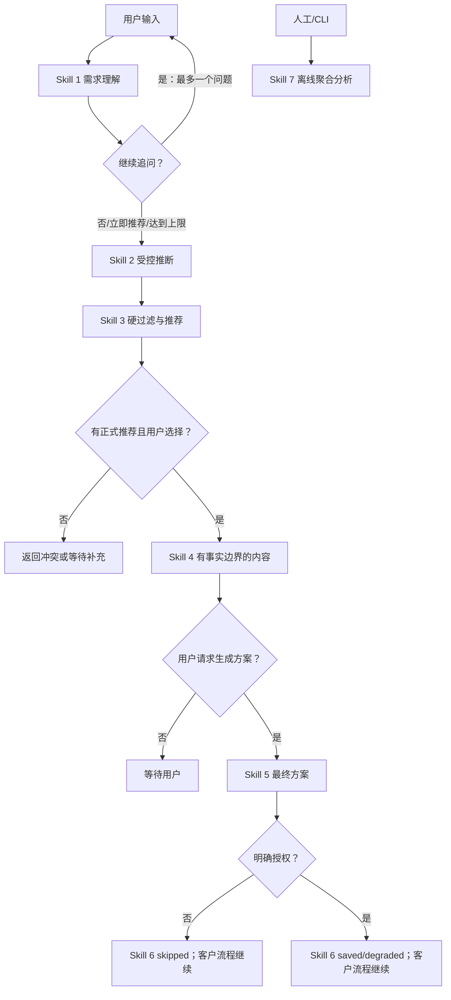

# Agent 编排与评审证据

## 1. Agent 目标与统一入口

飞颐礼遇 Agent 将模糊礼赠需求转化为 0–3 件真实目录推荐，并在用户选品后生成可下载方案。公开 UI 只调用：

```python
run_agent_turn(
    user_turn: UserTurn,
    session_state: AgentSessionState,
    catalog: CatalogSnapshot,
    runtime_config: AgentRuntimeConfig,
) -> AgentTurnResult
```

Skill 7 使用独立入口 `run_choice_signal_analysis(request, repository, runtime_config)`，不会加入客户主链。

## 2. 七项 Skills

| 顺序 | Skill / 代码入口 | 输入 → 输出 | 触发 | 安全回退 |
|---|---|---|---|---|
| 1 | `understand_gift_request` / `request_understanding_skill.execute` | 消息+现有会话 → 更新需求、一个问题、解析来源 | 新消息或修改 | `deterministic_parser` |
| 2 | `infer_soft_preferences` / `preference_inference_skill.execute` | 已验证需求 → 带来源的有效上下文 | 推荐前 | `preserve_unknown` |
| 3 | `recommend_heritage_gifts` / `recommendation_skill.execute` | 上下文+20件正式商品 → 0–3件推荐、冲突、替代 | 信息足够/立即推荐/追问上限 | `no_match_response` |
| 4 | `compose_grounded_content` / `content_skill.execute` | 选中商品+审核文本 → 双语内容 | 选品或生成方案 | `omit_unverified_content` |
| 5 | `build_final_gift_plan` / `final_plan_skill.execute` | 最终需求+商品+内容 → Inquiry JSON | 已选品并点击生成 | `omit_unknown_commercial_fields` |
| 6 | `capture_consented_choice` / `choice_capture_skill.execute` | 授权+匿名事件链 → saved/skipped/degraded | 选品或生成方案 | `continue_without_storage` |
| 7 | `analyze_gift_choice_signals` / `choice_analysis_skill.execute` | 授权匿名数据+筛选 → 聚合报告 | CLI/人工按需 | `insufficient_sample_report` |

这些包装只验证输入、调用现有模块并标准化结果；解析、推断、评分、内容、Inquiry 和分析逻辑没有复制到编排器。

## 3. 可执行门控状态机



实际代码保证：每轮最多一个主动问题；立即推荐不被追问阻断；达到追问上限进入推荐；0 结果不调用产品型 Skill 4/5；未选品不生成方案；未授权零写入；存储故障只降级；Skill 7 不自动运行或改权重；新核心需求使旧推荐、选择、内容和方案失效。

## 4. Execution trace

`SkillExecutionTrace` 包含 Skill ID/名称/顺序、状态、触发原因、允许列表摘要、回退、安全检查、非负耗时和时间戳。状态支持 `success/skipped/fallback/blocked/degraded/failed_safe`。

集中式 `safe_summary` 只接受字段名、数量、目录统计、受控状态和布尔值。它不记录用户原文、完整聊天、Prompt、模型原始输出、姓名、电话、邮箱、详细地址、Key、数据库 URL、SQL、内部 UUID 或堆栈。Trace 只留在当前 Streamlit session，不写入分析库。

## 5. 评审模式

默认客户页面不显示 Trace。必须同时设置：

```powershell
$env:AGENT_REVIEW_MODE_ENABLED="true"
python -m streamlit run app.py
```

并访问 `http://localhost:8501/?review_mode=1`。页面底部才显示“Agent 执行轨迹”。去掉任一条件即关闭。

## 6. 主流程与分析支线

Skills 1–6 属于同步客户流；Skill 7 标记为 `offline_on_demand`，只通过显式 Python 入口或 CLI 运行。分析只描述带最小样本保护的相关关系，不输出个人记录，不回写推荐配置。

## 7. 四条可复现轨迹

- A 正常：示例需求 → Skills 1–3 → 选择 → Skill 4 → 生成 → Skill 5 → Skill 6 按授权处理。
- B 无 DeepSeek：Skill 1 `fallback/deterministic_parser`，Skills 2–3 继续。
- C 强冲突：500件、100元、Logo、3天、寄美国 → Skill 3 返回0件；Skills 4/5 `skipped`。
- D 数据：未授权 `skipped_no_consent`；授权+内存/SQLite `saved`；授权+无仓库 `degraded`，方案均不阻断。

自动化证据位于 `tests/test_agent_orchestration.py` 与 `tests/test_agent_manifest.py`。

## 8. 代码映射与当前限制

- 合同：`agent_models.py`
- 注册表：`agent_registry.py`
- 门控：`agent_orchestrator.py`
- 脱敏：`agent_trace.py`
- 薄包装：`src/heritagelink/skills/`
- 机器声明：`docs/wave3/agent_manifest.yaml`

当前推荐只使用20件正式 Demo 商品，另30件为不可推荐的馆藏参考。DeepSeek 可选；PostgreSQL 未做真实服务集成测试；Trace 不持久化；分析不会自动优化权重。

