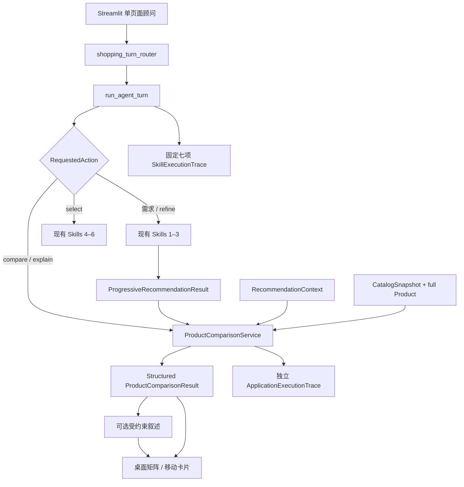

# HAHA AI Shopping 与可信商品比较

## 1. 目标与不变边界

本轮把“返回推荐后立即选品”扩展为连续的顾问式决策过程：

```text
Recommendation
→ Structured Comparison
→ Conversational Refinement
→ Selection
→ Final Plan
```

Product comparison is an application-layer capability and does not change the seven-skill Agent contract.

以下边界保持不变：

- 客户动作继续通过 `run_agent_turn(...)`，结果继续使用 `AgentTurnResult`；
- 七项正式 Skills、Agent manifest 和 Skill 1–7 的业务职责不变；
- 推荐器原有硬过滤、八维固定权重、稳定排序和零结果语义不变；
- 20 件 `recommendation_demo/active` 是正式推荐范围，30 件 `inactive/catalog_reference` 仍只作参考；
- 比较不创建 `comparison_score`、AI 分、星级或第二套排名；
- 不增加 RAG、向量数据库、商品语义重排或新核心 Skill；
- 价格、材料、认证、交付、运输、产能与定制能力没有可靠依据时保持未知。

## 2. 集成架构



`shopping_turn_router` 只在已有当前推荐时运行于 Skill 1 之前。普通需求仍进入 Skill 1；比较与差异解释直接读取当前正式推荐；相对偏好调整才重新进入 Skills 1–3；选品继续使用现有 Skills 4–6。Skill 7 仍是离线、显式调用的匿名聚合分析，不参与比较。

## 3. 唯一动作模型

`RequestedAction` 在原枚举中增加四项能力，没有创建第二套动作系统：

| 动作 | 输入示例 | 执行方式 |
|---|---|---|
| `compare_recommendations` | “帮我比较这三个” | 比较当前全部正式推荐 |
| `compare_selected_products` | “只比较前两个” | 只比较解析出的当前推荐 ID |
| `explain_difference` | “第一个为什么更适合商务？” | 解释当前范围，不重新推荐 |
| `refine_recommendations` | “再现代一点” | 更新明确偏好并重跑现有推荐链 |

`select_product` 继续处理“那我选第一个”。`UserTurn` 使用 `product_id`、`product_ids` 和 `comparison_focus` 承载解析结果；序号先对当前 `RecommendationResponse.recommendations` 解析，不接受目录中任意 ID。

当前路由支持中文一、二、两、三及 1、2、3，支持“前两个”，并识别教授/商务、文化、预算、风格、定制、海外运输、数量和交期等比较重点。路由是有界规则，不解析商品事实、不推断商家能力，也不维护独立对话状态。

相对偏好更新仅覆盖明确表达的方向。例如“不要太传统”或“再现代一点”将当前风格修订为更现代；“更重视文化故事”补充文化传承方向。只说“更便宜”但没有提供新金额时，系统先询问新的单件预算上限，不擅自制造预算。

## 4. 结构化比较合同

### 4.1 请求

`ProductComparisonRequest` 包含：

- `product_ids`：`None` 表示当前全部推荐；显式范围必须为 1–3 个且不能重复；
- `comparison_dimensions`：可选的受控比较维度；
- `focus_recipient`、`focus_scene`、`focus_styles`、`focus_symbolism`、`focus_customization`、`focus_international`：只覆盖本次解释重点，不改写正式排名。

### 4.2 证据

`ComparisonEvidence` 为每个事实保存：

- `state`：四态 `EvidenceState`；
- `display`：客户可读文字；
- `source_fields`：用于本地审计的字段来源，客户页面不显示。

四种状态的含义：

| 状态 | 含义 | 客户表达示例 |
|---|---|---|
| `verified_yes` | 可靠字段确认支持或匹配 | “已确认支持……” |
| `verified_no` | 可靠字段确认不支持或不匹配 | “已确认不支持……” |
| `unknown` | 字段缺失或现有状态不足以作事实断言 | “待确认”“暂无可靠信息” |
| `not_applicable` | 当前需求没有提出该条件 | “本次未提供单件预算” |

`unknown` 与 `verified_no` 不可互换。非空演示字段也不会仅因非空就升级为已验证事实。

### 4.3 单商品比较项

`ProductComparisonItem` 保存：

- 产品 ID、名称和原推荐名次；
- 价格展示与预算适配证据；
- 收礼人、场景、风格、文化寓意适配证据；
- 定制、数量、工期、便携性、国际运输证据；
- 文化优势、实用优势、限制；
- 已验证字段和未知字段清单。

材料、认证和非遗级别不在当前比较 schema 中，因此比较不会凭空补写这些事实。

### 4.4 比较结果

`ProductComparisonResult` 保存：

- `compared_product_ids`、`comparison_dimensions` 和有序 `items`；
- `best_for`：把“当前需求”“文化表达”等客户方向映射到已有商品，不是新分数；
- `tradeoffs`：逐商品取舍；
- `recommendation_for_current_user` 与条件化原因；
- `unknown_or_unverified`；
- `deterministic_summary`；
- 可选 `ai_explanation` 与 `explanation_source`；
- `original_ranking_preserved=True`；
- 客户友好的 `context_summary`。

单件比较是允许的安全状态：它只解释该商品与当前需求的依据，并明确不形成商品间优劣结论。

## 5. 正式资格与顺序安全

服务执行两层准入校验：

1. 请求中的每个 ID 必须存在于当前 `ProgressiveRecommendationResult.response.recommendations`；
2. 使用 `CatalogSnapshot.products` 查找完整 `Product`，再次确认：
   - `catalog_role == recommendation_demo`；
   - `product.status == active`；
   - `merchant_status == active`；
   - `heritage_status == active`。

任一校验失败即安全拒绝比较，不会降级为比较 reference-only 产品。`product_ids` 只定义范围，不定义顺序：服务按原推荐列表过滤范围，因此输入 `(第三件, 第一件)` 仍输出 `(第一件, 第三件)`。当前建议款是被比较范围中原推荐名次最靠前的商品，并用结构化优势与待确认项解释；它不是重新排名的结果。

## 6. 默认维度与上下文变化

默认客户维度为：适合谁、适用场景、风格、文化表达、预算、定制、实用考虑。显示顺序会根据当前需求改变，但不会改变推荐顺序：

- 教授/教师或长辈：先说明收礼人、文化表达与风格；
- 商务伙伴、商务礼赠、周年或纪念：先说明对象/场景、定制与实用考虑；
- 海外礼赠：更早说明文化表达与国际相关的实用信息；
- 其他情况：使用通用维度顺序。

预算适配只允许“预算内”“接近预算”“超出预算”“价格待确认”。只有商业事实状态达到允许验证级别时，才会根据真实价格区间与当前单件预算判断；当前演示商业状态不足时，即使有目录区间也显示“演示区间，待确认”，适配保持 `unknown`。

定制项逐条读取启用的 `customization_options` 及其事实状态。Logo、题字、包装、尺寸等没有可靠状态时显示“目录提供演示方向，具体能力待确认”或“暂无可靠能力信息”，不能从产品卡文案推断为支持。

数量、交期、国际运输遵循同样规则。便携性不会从尺寸文字自动推断，最多展示尺寸依据并继续标为待确认。

## 7. 可选语言叙述与确定性回退

结构化比较始终先完成。`ProductComparisonService` 可通过 `explanation` 或 `explanation_client` 注入一个受约束的叙述器；默认未注入时直接使用 deterministic summary。

叙述器只收到脱敏后的商品名称、结构化适配文字、优势、限制、当前选择、取舍和客户上下文。输入明确禁止增加价格、材料、认证、运输、交付、产能或定制事实。

返回内容还要通过本地校验，包括：

- 必须是简洁非空文本，不能包含 URL；
- 不能泄露内部 ID 或技术字段；
- 不能引入未经上下文支持的数字；
- 不能新增认证、大师、传承人、材料、现货、产能或包邮断言；
- 当价格、运输、定制、交期、数量或便携性为未知时，不能把对应能力写成肯定或否定事实。

调用抛错或任何校验失败都会丢弃叙述，返回 deterministic summary。客户页面只显示最终顾问语言；评审模式才显示 `llm` 或 `deterministic_fallback`。

## 8. Streamlit Shopping UI

正式推荐有 2–3 件时，标题附近显示“比较这2件”或“比较这3件”。每张卡提供选品与比较快捷动作。比较区位于推荐卡下方，继续使用同一聊天输入，不打开独立页面。

桌面端使用语义化列式矩阵：第一列是比较维度，后续列是当前商品；不使用 DataFrame、雷达图或新评分。860px 以下隐藏矩阵并显示逐商品卡片，避免横向滚动。两种布局由同一 `ProductComparisonResult` 生成。

比较区还显示：

- 条件化的当前建议与理由；
- 商品间取舍；
- 集中列出的待确认项；
- “为什么这样比较？”中的客户友好上下文；
- “选择推荐款”“继续比较”“调整需求”操作。

未知状态始终包含“待确认”文字，不能只靠颜色、对勾或叉号表达。Customer mode 不显示证据枚举、source fields、技术评分、内部 ID 或叙述来源。

## 9. 会话、失效与隐私

`AgentSessionState` 新增当前 `comparison_result` 与最近三次 `comparison_history`。比较动作把用户问题和顾问摘要追加到现有 `ConversationState`，因此用户可继续追问或选品。

- 新的需求或相对偏好调整会使当前推荐和当前比较失效，再运行原推荐链；
- 选品不会把比较伪装成商品事实，仍只接受当前正式推荐 ID；
- “重新开始”清空当前比较和 session 内历史；
- 比较历史不进入现有 Repository；
- 现有匿名选择 consent 不会自动扩张为 `comparison_requested` 等新事件授权；
- Application trace 只保留脱敏计数、维度、状态与安全检查，不记录原始聊天或个人信息。

## 10. Review Mode

正式 `execution_trace` 始终维持七项 `SkillExecutionTrace`。比较动作不会运行新 Skill；七项轨迹明确为 skipped，原因是“商品比较是应用层动作，沿用当前正式推荐”。

比较另返回独立 `ApplicationExecutionTrace`：

```text
Application Action: product_comparison
structured_comparison: success / blocked / failed_safe
narrative_source: llm / deterministic_fallback
original_ranking_unchanged: true
unknown_preserved: true / false
safety_checks:
  formal_recommendations_only
  original_ranking_unchanged
  unknown_preserved
  no_pii_in_trace
```

只有同时设置评审环境开关并使用 `?review_mode=1` 时，Streamlit 页面才在固定七项 Skill 轨迹之后显示 Application Actions。普通客户 URL 不显示任何技术 Trace。

## 11. 验收方式

先执行静态检查与自动化测试：

```powershell
python -m ruff format --check .
python -m ruff check .
python -m pytest
```

2026-08-12 实际执行结果：Ruff format check 与 Ruff check 均通过，`pytest` 为 `206 passed`。

再启动本地页面：

```powershell
python -m streamlit run app.py
```

浏览器依次完成：

1. 教授：比较三件、追问第一与第三、调整得更现代、自然语言选择第一件并生成方案；
2. 商务：30 位海外伙伴、周年、单件预算 1200 元、Logo，核对上下文维度顺序；
3. Unknown：核对商业未知显示待确认而不是不支持；
4. Narrative failure：未注入或让叙述器失败，核对 deterministic fallback 与客户安全表达。

逐步输入与记录模板见 [`../wave3/DEMO.md`](../wave3/DEMO.md)。

## 12. 当前限制

- 比较范围限当前推荐中的 1–3 件商品；
- Shopping router 是中文有界规则，不是开放式商品问答系统；
- 当前编排器在 LLM 开启且本地 Key 有效时注入受约束的 comparison narrative client；未配置、调用失败或结果未通过本地校验时使用确定性回退；
- 当前商业商品字段主要是演示状态，比较会保守地产生较多“待确认”；
- 比较历史只在当前 Streamlit session 内保留最多三次，不支持账号、跨设备或长期历史；
- 本轮不持久化比较行为，也不使用比较行为更新推荐权重；
- 比较只解释当前推荐，不能发现目录外类似款或创造混合商品。

相关基线：[`../UX_SPEC.md`](../UX_SPEC.md)、[`../PRODUCT_SPEC.md`](../PRODUCT_SPEC.md)、[`../ARCHITECTURE.md`](../ARCHITECTURE.md)、[`../RECOMMENDATION_DESIGN.md`](../RECOMMENDATION_DESIGN.md)、[`../wave3/ORCHESTRATION.md`](../wave3/ORCHESTRATION.md)。
