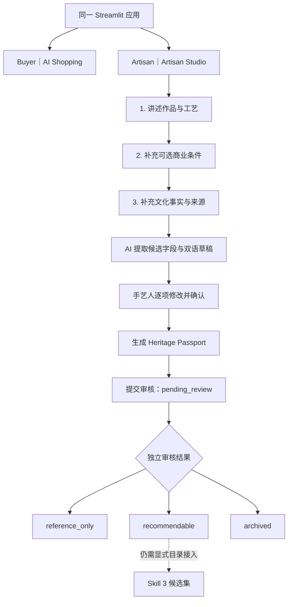

# HAHA Artisan Studio｜手艺人作品入驻工作台

## 1. 目标与定位

Artisan Studio 为非遗手艺人和小型文化品牌提供一个低门槛的作品资料整理入口。它与 Buyer 侧 AI Shopping 共用同一个 Streamlit 应用、同一套品牌头部和设计语言，不另建管理站点：

- 默认进入 Buyer 模式，继续使用现有礼赠顾问、商品比较和询盘流程；
- 顶部模式切换可以进入 Artisan 模式；
- `?mode=artisan` 可以直接打开手艺人入口；
- 切换模式不改变 Buyer 侧的推荐合同，也不把手艺人草稿自动加入目录。

本轮解决的是“把手艺人的非结构化资料整理成可审核草稿”，不是生产级商家入驻、身份认证、合同签署或商品上架后台。

## 2. 体验流程



### 2.1 第一步：作品故事

第一步收集最少身份信息和自由描述：

- 作品名称；
- 工艺名称；
- 地域；
- 可选图片；
- 手艺人自己的自由描述。

这些输入可以不完整。缺失值保持未知，不使用占位内容冒充事实。

### 2.2 第二步：商业资料

商业资料全部允许跳过或选择未知，包括：

- 价格区间与币种；
- 最低起订量、交期和产能；
- Logo、题字、包装、尺寸等定制方向；
- 材料与尺寸；
- 国内及国际运输能力。

`unknown` 不等于 `false`。例如“未提供国际运输信息”只能显示为待确认，不能显示为“不支持国际运输”。当前输入也不构成报价、库存、产能或履约承诺。

### 2.3 第三步：文化资料与来源

第三步收集工艺背景、地域文化、文化寓意、制作流程、适用礼赠场景，以及可选的文化资料、商家资料和其他 HTTPS 来源链接。来源链接用于追溯，不代表平台已完成文化审核或为手艺人身份背书。

## 3. AI 辅助与确定性回退

AI 只执行两类受控工作：

1. 从手艺人自由描述中提取字段候选；
2. 基于当前已知字段生成中英文产品表达草稿。

AI 不得确认文化事实、商业能力、非遗资质、传承人身份或政府背书。所有 AI 候选使用 `source=ai_inferred` 与 `verification_status=pending_review`，只有手艺人的显式确认操作才能升级对应字段。

无 API Key、调用超时、认证失败、网络错误、空响应、非法 JSON 或本地校验失败时，流程使用有限的确定性提取与模板化双语草稿继续运行。回退不会补造资料，也不会跳过人工确认。

## 4. 事实来源与人工确认

每一项 `ProvenancedFact` 独立保存值、事实分组、来源、核验状态、来源说明和确认时间。来源值为：

| `FactSource` | 含义 |
|---|---|
| `artisan_provided` | 手艺人在表单中录入，尚未完成显式确认 |
| `artisan_confirmed` | 手艺人在审核步骤中明确确认 |
| `merchant_confirmed` | 未来由经过认证的商家确认 |
| `public_source` | 有可追溯公开来源；仍需判断来源是否支持该断言 |
| `ai_inferred` | AI 提取或生成的候选，不是事实确认 |
| `unknown` | 当前没有可依赖来源 |

核验状态采用四态：`confirmed`、`pending_review`、`unknown`、`not_applicable`。AI 字段不能直接成为 `confirmed`；确认操作按字段执行，不会把整份草稿一次性“洗白”。双语内容也有独立的来源和核验状态。

## 5. 冲突保护

价格、材料、定制能力、最低起订量、运输和交期等受保护字段出现新旧值不一致时，系统生成 `FactConflict`，同时保留：

- `current_value`；
- `incoming_value`；
- 用户明确选择后的 `resolved_value`。

未解决冲突不会静默覆盖原值，也不能提交审核。空值或未知值不能擦除已有事实。

## 6. 独立草稿 Repository

`ArtisanProductDraft` 不复用 Buyer 匿名行为分析表，也不直接写入 `data/demo/products.csv`。仓库提供同一协议的两种实现：

- `MemoryArtisanDraftRepository`：当前 Streamlit 会话与测试使用的内存实现；
- `SQLiteArtisanDraftRepository`：本地开发的持久化实现，保存草稿 JSON、状态和时间戳。

这条隔离保证：

- 未提交资料不污染 Buyer 目录；
- `pending_review` 草稿不会出现在推荐或比较中；
- 手艺人资料不会被误写入仅用于匿名买家选择分析的 Repository；
- 模拟审核也不会自动修改 canonical CSV 或创建正式商品。

## 7. 发布生命周期

```text
draft
  → pending_review
      → reference_only
      → recommendable
      → archived
```

| 状态 | 用途 | 是否可进入 Skill 3 |
|---|---|---:|
| `draft` | 尚在填写和修改 | 否 |
| `pending_review` | 已提交，等待审核 | 否 |
| `reference_only` | 可作文化参考，商业条件不足 | 否 |
| `recommendable` | 通过独立资格审核的发布状态 | 仅在显式接入 canonical 目录后 |
| `archived` | 已撤回或停用 | 否 |

提交动作只把草稿变为 `pending_review`。评审模式中的“模拟审核”只有在必需的身份、文化和商业字段逐项确认、至少一个来源已确认且图片存在时才会显示 `recommendable`；否则降为 `reference_only`。这个演示状态转换仍不会把记录插入 Buyer 目录。生产环境必须在身份认证、商家主体核验、文化来源审核、商业能力复核和发布授权之后，执行一条明确、可审计的目录接入流程。

## 8. 推荐与七项 Skills 的边界

Artisan Studio 是 application-layer workflow，执行轨迹使用：

```text
Application Action: artisan_product_onboarding
```

它不是第八项 Skill，不修改 Agent manifest，也不改变现有七项 Skills 的输入、输出、顺序、权重或门控。Skill 3 的正式候选集继续由本地资格门控制，并且只接受逻辑发布状态为 `recommendable` 的 canonical `Product`。现有 CSV 没有新增发布状态列，因此资格适配层把 `recommendation_demo` 且产品、商家和工艺均为 `active` 的旧记录映射为 `recommendable`，把 `catalog_reference/inactive` 映射为 `reference_only`。手艺人草稿即使在演示中显示 `recommendable`，也不会自行转换为 `Product`。

当前目录边界保持不变：

- 50 条 canonical 产品记录；
- 20 条 `recommendation_demo/active` 可参与演示推荐；
- 30 条 `catalog_reference/inactive` 只作参考；
- 新提交的手艺人草稿不改变以上计数。

## 9. Review Mode 与生产边界

Application trace 和模拟审核只在既有双门控制生效时展示：环境侧启用评审模式，并在 URL 使用 `review_mode=1`（配置了评审 token 时还必须提供正确 token）。公开 Buyer 或 Artisan 页面不展示内部字段、原始 Prompt、API Key、数据库地址或完整异常。

当前实现是产品验证原型。生产化至少还需要：

- 手艺人和商家账号及身份认证；
- 商家主体、授权关系与联系方式核验；
- 角色权限、审核责任、撤回和申诉机制；
- 图片、商标、题字和文化资料的权利证明；
- 正式数据保留、删除、加密与审计策略；
- 价格、库存、产能、交期、物流和定制能力的持续复核。

这些能力尚未实现，因此当前草稿、模拟审核状态和 Heritage Passport 均不代表真实入驻、正式在售或平台背书。
